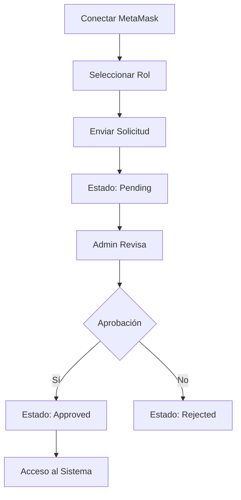
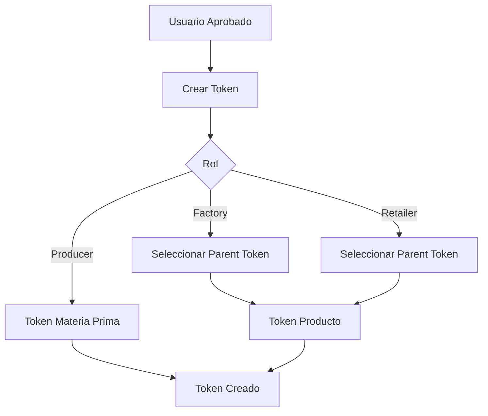
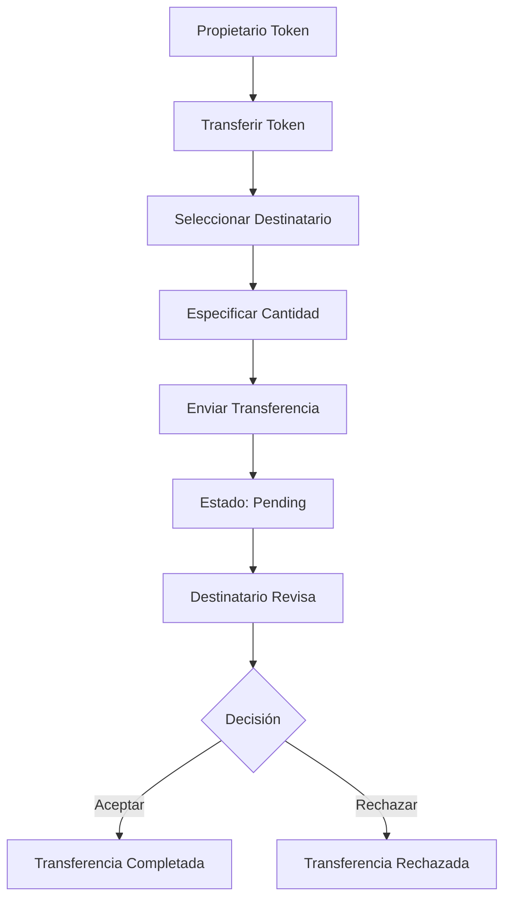

# 🔗 Supply Chain Tracker - Proyecto de Desarrollo Blockchain

## 🎯 Objetivos del Proyecto

**Supply Chain Tracker** es un proyecto educativo donde desarrollarás desde cero una aplicación descentralizada (DApp) completa para gestionar trazabilidad en cadenas de suministro.

### 📚 Objetivos de Aprendizaje

1. **Desarrollo de Smart Contracts**: Programar contratos inteligentes en Solidity desde cero
2. **Testing Blockchain**: Escribir y hacer pasar tests unitarios con Foundry
3. **Aplicaciones Descentralizadas (DApps)**: Construir un frontend completo que interactúe con blockchain
4. **Gestión de Roles y Permisos**: Implementar un sistema de solicitud de roles y aprobación por administrador.
5. **Integración Web3**: Conectar aplicaciones web con MetaMask y Ethereum
6. **Desarrollo Full-Stack**: Combinar tecnologías frontend modernas con blockchain

### Objetivo relacionado con la IA

1. Uso de la Inteligencia Artificial para el desarrollo del proyecto.
2. Retrospectiva del uso de la IA. (HACER UN FICHERO IA.md)
   2.1. IA usadas
   2.2. Tiempo consumido aproximado separando el smart contract y el frontend.
   2.3. Errores mas habituales analizando los chats de la IA.
   2.4. Ficheros de los chat de la IA.
3. Construccion de un MCP que envuelva los cli de foundry anvil, cast, forge.
4. Opcional. Manejo del contrato inteligente en la aplicacion con la IA.

### 🏗️ Objetivos Técnicos

Tu aplicación final debe implementar:

- **Sistema transparente y seguro** para rastrear productos desde origen hasta consumidor final
- **Tokenización** de materias primas y productos terminados
- **Flujo controlado** entre actores: Producer → Factory → Retailer → Consumer
- **Gestión de roles** con aprobación por administrador
- **Interfaz intuitiva** para todos los roles del sistema

### 🖼️ Vista Previa de la Aplicación

## Implementacion de referencia. (url )

## 🏭 Actores del Sistema

### 1. 👨‍🌾 **Producer (Productor)**

- **Función**: Registra materias primas en el sistema
- **Permisos**: Crear tokens de materias primas, transferir solo a Factory
- **Ejemplos**: Granjas, minas, productores agrícolas

### 2. 🏭 **Factory (Fábrica)**

- **Función**: Transforma materias primas en productos terminados
- **Permisos**: Recibir de Producer, crear productos derivados, transferir solo a Retailer
- **Ejemplos**: Plantas procesadoras, manufactureras

### 3. 🏪 **Retailer (Minorista)**

- **Función**: Distribuye productos a consumidores
- **Permisos**: Recibir de Factory, transferir solo a Consumer
- **Ejemplos**: Tiendas, supermercados, distribuidores

### 4. 🛒 **Consumer (Consumidor)**

- **Función**: Punto final de la cadena
- **Permisos**: Recibir productos, consultar trazabilidad completa
- **Ejemplos**: Usuarios finales, clientes

### 5. 👑 **Admin (Administrador)**

- **Función**: Gestiona el sistema y aprueba usuarios
- **Permisos**: Aprobar/rechazar registros, supervisar el sistema
- **Nota**: Rol único del creador del contrato

---

## 🛠️ Prerequisitos e Instalación

### 📋 Requisitos del Sistema

Antes de comenzar, asegúrate de tener instalado:

1. **Node.js** (versión 18 o superior)

   ```bash
   # Verificar versión
   node --version
   npm --version
   ```

2. **Git**

   ```bash
   git --version
   ```

3. **Foundry** (para smart contracts)

   ```bash
   # Instalar Foundry
   curl -L https://foundry.paradigm.xyz | bash
   foundryup

   # Verificar instalación
   forge --version
   anvil --version
   ```

4. **MetaMask Browser Extension**
   - Instalar desde [metamask.io](https://metamask.io/)
   - Crear una wallet de prueba

### 🔧 Configuración del Entorno

#### 1. **Clonar el Repositorio**

```bash
git clone 98_pfm_traza_2025

cd supply-chain-tracker
```

#### 2. **Configurar Smart Contracts (`sc/`)**

```bash
cd sc

# Instalar dependencias de Foundry
forge install

# Compilar contratos
forge build

# Ejecutar tests (opcional pero recomendado)
forge test

# Verificar que todo funciona
ls out/  # Debe mostrar archivos compilados
```

#### 3. **Configurar Frontend (`web/`)**

```bash
npx create-next-app@latest web --typescript

cd ../web

# Instalar dependencias de Node.js
npm install

# Verificar que no hay errores
npm run build
```

#### 4. **Configurar Blockchain Local**

**Terminal 1 - Ejecutar Anvil:**

```bash
# Iniciar blockchain local
anvil

# Copiar las private keys que aparecen
# Ejemplo de salida:
# Account #0: 0xf39Fd6e51aad88F6F4ce6aB8827279cffFb92266
# Private Key: 0xac0974bec39a17e36ba4a6b4d238ff944bacb478cbed5efcae784d7bf4f2ff80
```

**Terminal 2 - Desplegar Contrato:**

```bash
cd sc

# Desplegar contrato (usa una private key de Anvil)
forge script script/Deploy.s.sol \
  --rpc-url http://localhost:8545 \
  --private-key 0xac0974bec39a17e36ba4a6b4d238ff944bacb478cbed5efcae784d7bf4f2ff80 \
  --broadcast

# Copiar la dirección del contrato desplegado
```

#### 5. **Configurar MetaMask**

1. **Agregar Red Local:**
   - Network Name: `Anvil Local`
   - RPC URL: `http://localhost:8545`
   - Chain ID: `31337`
   - Currency Symbol: `ETH`

2. **Importar Cuentas de Prueba:**
   - Importar private keys de Anvil para testing
   - Recomendado: al menos 4 cuentas diferentes (
   ```
      admin (0xf39Fd6e51aad88F6F4ce6aB8827279cffFb92266),
      producer (0x70997970C51812dc3A010C7d01b50e0d17dc79C8),
      factory (0x3C44CdDdB6a900fa2b585dd299e03d12FA4293BC),
      retailer (0x90F79bf6EB2c4f870365E785982E1f101E93b906),
      consumer (0x15d34AAf54267DB7D7c367839AAf71A00a2C6A65))
   ```

#### 6. **Actualizar Configuración**

**Archivo: `web/src/contracts/config.ts`**

```typescript
export const CONTRACT_CONFIG = {
  address: "0x...", // Dirección del contrato desplegado
  abi: SupplyChainABI,
  adminAddress: "0xf39Fd6e51aad88F6F4ce6aB8827279cffFb92266", // Primera cuenta de Anvil
};
```

#### 7. **Iniciar Aplicación**

```bash
cd web

# Modo desarrollo
npm run dev

# Abrir http://localhost:3000
```

---

## 🚀 Funcionalidades a Implementar

### 🔐 **Sistema de Autenticación Web3**

Deberás codificar:

- **Conexión con MetaMask**
- **Persistencia en localStorage** - mantiene sesión al recargar
- **Desconexión automática** - limpia datos del localStorage
- **Detección de cambios de cuenta** - reconecta automáticamente

### 💳 **Gestión de Usuarios**

Tu implementación debe incluir:

- **Registro por roles**
- **Aprobación por administrador** antes de usar el sistema
- **Estados**: Pending, Approved, Rejected, Canceled

### 🪙 **Sistema de Tokens**

Desarrollarás:

- **Creación de tokens** que representan productos/materias primas
- **Metadatos JSON** para características del producto
- **Sistema de parentesco** - productos derivan de materias primas
- **Balance individual** por usuario y token

### 📦 **Transferencias Controladas**

Implementarás:

- **Flujo dirigido**: Producer → Factory → Retailer → Consumer
- **Sistema de aprobación** - el receptor debe aceptar
- **Validación automática** de permisos por rol
- **Trazabilidad completa** de movimientos

### 🎨 **Interfaz Moderna**

Crearás:

- **Design responsive** con Tailwind CSS
- **Componentes reutilizables** con Shadcn UI
- **Navegación intuitiva** según rol del usuario

---

## 📱 Estructura de la Aplicación

### 🌐 **Páginas Principales**

#### **`/` - Página Principal**

- **No conectado**: Invitación a conectar MetaMask
- **Conectado pero no registrado**: Formulario de registro por rol
- **Conectado y pendiente**: Estado de espera de aprobación
- **Conectado y aprobado**: Bienvenida con acceso a dashboard

#### **`/dashboard` - Panel Principal**

- **Resumen personalizado** según rol
- **Estadísticas** de tokens y transferencias
- **Accesos rápidos** a funcionalidades principales

#### **`/tokens` - Gestión de Tokens**

- **Lista de tokens** propiedad del usuario
- **Crear token** (`/tokens/create`)
- **Detalles** (`/tokens/[id]`)
- **Transferir** (`/tokens/[id]/transfer`)

#### **`/transfers` - Transferencias**

- **Pendientes de aceptación**
- **Historial completo**
- **Acciones**: Aceptar/Rechazar

#### **`/admin` - Administración** (solo Admin)

- \*\*Panel de administración del sistema
- **Gestión de usuarios** (`/admin/users`)

#### **`/profile` - Perfil**

- **Información del usuario**
- **Portfolio de tokens**

### 🏗️ **Estructura del Proyecto a Crear**

Tu tarea es crear toda esta estructura desde cero:

```
📁 supply-chain-tracker/
├── 📁 sc/                          # Smart Contracts (TU TAREA)
│   ├── 📁 src/
│   │   └── SupplyChain.sol         # ⚠️ CONTRATO PRINCIPAL A PROGRAMAR
│   ├── 📁 script/
│   │   └── Deploy.s.sol            # ⚠️ SCRIPT DE DESPLIEGUE A CREAR
│   ├── 📁 test/
│   │   └── SupplyChain.t.sol       # ⚠️ TESTS A ESCRIBIR Y HACER PASAR
│   └── foundry.toml                # ⚠️ CONFIGURACIÓN A CREAR
├── 📁 web/                         # Frontend Next.js (TU TAREA)
│   ├── 📁 src/
│   │   ├── 📁 app/                 # ⚠️ TODAS LAS PÁGINAS A IMPLEMENTAR
│   │   ├── 📁 components/          # ⚠️ COMPONENTES REACT A CREAR
│   │   ├── 📁 contexts/            # ⚠️ WEB3 PROVIDER A PROGRAMAR
│   │   ├── 📁 hooks/               # ⚠️ CUSTOM HOOKS A DESARROLLAR
│   │   ├── 📁 lib/                 # ⚠️ SERVICIOS WEB3 A IMPLEMENTAR
│   │   └── 📁 contracts/           # ⚠️ ABI Y CONFIGURACIÓN A CREAR
│   ├── package.json                # ⚠️ DEPENDENCIAS A CONFIGURAR
│   └── tailwind.config.js          # ⚠️ ESTILOS A CONFIGURAR
├── 📁 screenshots/                 # Imágenes de referencia (PROPORCIONADAS)
└── README.md                      # Esta guía (PROPORCIONADA)
```

> **⚠️ IMPORTANTE**: Solo se proporciona este README.md y las imágenes de referencia. Todo el código debe ser desarrollado por ti.

---

## 🔄 Flujos de Trabajo

### 1. **Registro de Usuario**



### 2. **Creación de Token**



### 3. **Transferencia**



---

## 📊 Estructuras de Datos a Implementar

### **🔥 PARTE 1: SMART CONTRACT (sc/src/SupplyChain.sol)**

#### **Enums a Definir**

```solidity
// ⚠️ TU TAREA: Definir estos enums
enum UserStatus { /* Estados del usuario */ Pending, Approved, Rejected, Canceled }
enum TransferStatus { /* Estados de transferencia */ Pending, Accepted, Rejected }
```

#### **Structs a Implementar**

```solidity
    enum UserStatus { Pending, Approved, Rejected, Canceled }
    enum TransferStatus { Pending, Accepted, Rejected }

    struct Token {
        uint256 id;
        address creator;
        string name;
        uint256 totalSupply;
        string features; // JSON string
        uint256 parentId;
        uint256 dateCreated;
        mapping(address => uint256) balance;
    }

    struct Transfer {
        uint256 id;
        address from;
        address to;
        uint256 tokenId;
        uint256 dateCreated;
        uint256 amount;
        TransferStatus status;
    }

    struct User {
        uint256 id;
        address userAddress;
        string role;
        UserStatus status;
    }

    address public admin;
    // contadores para los ids de los tokens, transfers y users
    uint256 public nextTokenId = 1;
    uint256 public nextTransferId = 1;
    uint256 public nextUserId = 1;
    // mapping para los tokens, transfers y users
    mapping(uint256 => Token) public tokens;
    mapping(uint256 => Transfer) public transfers;
    mapping(uint256 => User) public users;
    mapping(address => uint256) public addressToUserId;

    // eventos para los tokens, transfers y users
    event TokenCreated(uint256 indexed tokenId, address indexed creator, string name, uint256 totalSupply);
    event TransferRequested(uint256 indexed transferId, address indexed from, address indexed to, uint256 tokenId, uint256 amount);
    event TransferAccepted(uint256 indexed transferId);
    event TransferRejected(uint256 indexed transferId);
    event UserRoleRequested(address indexed user, string role);
    event UserStatusChanged(address indexed user, UserStatus status);

```

#### **Funciones del Contrato a Implementar**

```solidity
// ⚠️ TU TAREA: Programar estas funciones principales

// Gestión de Usuarios
function requestUserRole(string memory role) public { }
function changeStatusUser(address userAddress, UserStatus newStatus) public { }
function getUserInfo(address userAddress) public view returns (User memory) { }
function isAdmin(address userAddress) public view returns (bool) { }

// Gestión de Tokens
function createToken(string memory name, uint totalSupply, string memory features, uint parentId) public { }
function getToken(uint tokenId) public view returns (Token memory) { }
function getTokenBalance(uint tokenId, address userAddress) public view returns (uint) { }

// Gestión de Transferencias
function transfer(address to, uint tokenId, uint amount) public { }
function acceptTransfer(uint transferId) public { }
function rejectTransfer(uint transferId) public { }
function getTransfer(uint transferId) public view returns (Transfer memory) { }

// Funciones auxiliares
function getUserTokens(address userAddress) public view returns (uint[] memory) { }
function getUserTransfers(address userAddress) public view returns (uint[] memory) { }
```

#### **Tests a Escribir (sc/test/SupplyChain.t.sol)**

```solidity
// ⚠️ TU TAREA: Escribir y hacer pasar estos tests
contract SupplyChainTest is Test {
    // Setup y configuración inicial
    function setUp() public { }

    // Tests de gestión de usuarios
    function testUserRegistration() public { }
    function testAdminApproveUser() public { }
    function testAdminRejectUser() public { }
    function testUserStatusChanges() public { }
    function testOnlyApprovedUsersCanOperate() public { }
    function testGetUserInfo() public { }
    function testIsAdmin() public { }

    // Tests de creación de tokens
    function testCreateTokenByProducer() public { }
    function testCreateTokenByFactory() public { }
    function testCreateTokenByRetailer() public { }
    function testTokenWithParentId() public { }
    function testTokenMetadata() public { }
    function testTokenBalance() public { }
    function testGetToken() public { }
    function testGetUserTokens() public { }

    // Tests de transferencias
    function testTransferFromProducerToFactory() public { }
    function testTransferFromFactoryToRetailer() public { }
    function testTransferFromRetailerToConsumer() public { }
    function testAcceptTransfer() public { }
    function testRejectTransfer() public { }
    function testTransferInsufficientBalance() public { }
    function testGetTransfer() public { }
    function testGetUserTransfers() public { }

    // Tests de validaciones y permisos
    function testInvalidRoleTransfer() public { }
    function testUnapprovedUserCannotCreateToken() public { }
    function testUnapprovedUserCannotTransfer() public { }
    function testOnlyAdminCanChangeStatus() public { }
    function testConsumerCannotTransfer() public { }
    function testTransferToSameAddress() public { }

    // Tests de casos edge
    function testTransferZeroAmount() public { }
    function testTransferNonExistentToken() public { }
    function testAcceptNonExistentTransfer() public { }
    function testDoubleAcceptTransfer() public { }
    function testTransferAfterRejection() public { }

    // Tests de eventos
    function testUserRegisteredEvent() public { }
    function testUserStatusChangedEvent() public { }
    function testTokenCreatedEvent() public { }
    function testTransferInitiatedEvent() public { }
    function testTransferAcceptedEvent() public { }
    function testTransferRejectedEvent() public { }

    // Tests de flujo completo
    function testCompleteSupplyChainFlow() public { }
    function testMultipleTokensFlow() public { }
    function testTraceabilityFlow() public { }
}
```

### **🌐 PARTE 2: FRONTEND (web/)**

#### **Páginas a Crear (app/)**

```typescript
// ⚠️ TU TAREA: Crear todas estas páginas

app/
├── page.tsx                     // Landing/Login/Register
├── layout.tsx                   // Layout principal con Web3Provider
├── dashboard/page.tsx           // Dashboard según rol
├── tokens/
│   ├── page.tsx                // Lista de tokens del usuario
│   ├── create/page.tsx         // Crear nuevo token
│   ├── [id]/page.tsx           // Detalles del token
│   └── [id]/transfer/page.tsx  // Transferir token
├── transfers/page.tsx           // Gestión de transferencias
├── admin/
│   ├── page.tsx                // Panel de administración
│   └── users/page.tsx          // Gestión de usuarios
└── profile/page.tsx            // Perfil del usuario
```

#### **Contextos y Hooks a Programar**

```typescript
// ⚠️ TU TAREA: Implementar Web3 Provider con localStorage
// contexts/Web3Context.tsx
export function Web3Provider({ children }) {
  // Estado global de conexión
  // Persistencia en localStorage
  // Reconexión automática
  // Gestión de eventos MetaMask
}

// hooks/useWallet.ts
export function useWallet() {
  // Hook que usa Web3Context
  // Expone funciones de conexión/desconexión
  // Maneja estado de usuario y tokens
}
```

#### **Servicios Web3 a Implementar**

```typescript
// ⚠️ TU TAREA: Crear servicio de interacción con blockchain
// lib/web3.ts
class Web3Service {
  // Conexión con MetaMask
  // Interacción con smart contract
  // Manejo de transacciones
  // Conversión de datos BigInt
}
```

#### **Componentes UI a Desarrollar**

```typescript
// ⚠️ TU TAREA: Crear componentes base y específicos
components/
├── ui/                    // Componentes base (shadcn/ui)
│   ├── button.tsx
│   ├── card.tsx
│   ├── select.tsx
│   └── label.tsx
├── Header.tsx             // Navegación principal
├── TokenCard.tsx          // Tarjeta de token
├── TransferList.tsx       // Lista de transferencias
└── UserTable.tsx          // Tabla de usuarios (admin)
```

#### **Configuración a Crear**

```typescript
// ⚠️ TU TAREA: Configurar integración blockchain
// contracts/config.ts
export const CONTRACT_CONFIG = {
  address: "0x...", // Dirección de tu contrato desplegado
  abi: [], // ABI generado por Foundry
  adminAddress: "0x...", // Admin del sistema
};

// Configuración de red Anvil
export const NETWORK_CONFIG = {};
```

---

## ⚠️ Errores Comunes y Soluciones

### 🚨 **Problemas de Conexión**

**Error**: "MetaMask not detected"

```typescript
// Solución: Verificar que MetaMask esté instalado
if (typeof window.ethereum === "undefined") {
  alert("Please install MetaMask!");
  return;
}
```

**Error**: "Wrong network"

```typescript
// Solución: Verificar chain ID
const chainId = await window.ethereum.request({ method: "eth_chainId" });
if (parseInt(chainId, 16) !== 31337) {
  alert("Please connect to Anvil network (Chain ID: 31337)");
}
```

### 🚨 **Problemas de Smart Contract**

**Error**: "Contract not deployed"

```bash
# Solución: Verificar que Anvil esté corriendo y redesplegar
anvil & # En un terminal
forge script script/Deploy.s.sol --rpc-url http://localhost:8545 --private-key 0x... --broadcast
```

**Error**: "Transaction reverted"

```solidity
// Causa común: Usuario no aprobado
// Solución: Verificar status del usuario en /admin/users
```

### 🚨 **Problemas de Frontend**

**Error**: Next.js params Promise

```tsx
// ❌ Incorrecto en Next.js 15+
function Page({ params }: { params: { id: string } }) {
  const id = params.id; // Error
}

// ✅ Correcto
import { use } from "react";
function Page({ params }: { params: Promise<{ id: string }> }) {
  const { id } = use(params);
}
```

**Error**: "localStorage is not defined"

```typescript
// Solución: Verificar que estamos en el cliente
if (typeof window !== "undefined") {
  localStorage.setItem("key", "value");
}
```

---

## 🧪 Testing y Validación

### **Tests de Smart Contract**

```bash
cd sc

# Ejecutar todos los tests
forge test

# Test específico con verbosidad
forge test --match-test testCreateToken -vvv

# Test con coverage
forge coverage
```

### **Validación de Frontend**

```bash
cd web

# Build de producción (detecta errores de tipos)
npm run build

# Linting
npm run lint

# Desarrollo con hot reload
npm run dev
```

### **Casos de Prueba Recomendados**

1. **Flujo completo de usuario**:
   - Registrarse como Producer
   - Crear token de materia prima
   - Transferir a Factory
   - Factory crea producto derivado
   - Continuar hasta Consumer

2. **Validación de permisos**:
   - Intentar transferir a rol incorrecto
   - Crear token sin estar aprobado
   - Acceder a páginas de admin sin permisos

3. **Estados de transferencia**:
   - Aceptar transferencia
   - Rechazar transferencia
   - Verificar actualización de balances

---

## 🎓 Plan de Desarrollo para Estudiantes

### **🚀 FASE 1: FUNDAMENTOS (OBLIGATORIO)**

1. **Configurar entorno de desarrollo**
   - Instalar Node.js, Foundry, MetaMask
   - Crear estructura de carpetas del proyecto
   - Configurar Anvil para blockchain local

2. **Desarrollar Smart Contract**
   - Programar `SupplyChain.sol` con todas las estructuras
   - Implementar todas las funciones requeridas
   - **✅ GOAL**: Todos los tests deben pasar con `forge test`

3. **Crear Frontend Base**
   - Configurar Next.js con TypeScript y Tailwind
   - Implementar Web3Provider con localStorage
   - Crear todas las páginas básicas

### **🔥 FASE 2: FUNCIONALIDAD CORE (OBLIGATORIO)**

4. **Sistema de Autenticación**
   - Conectar con MetaMask
   - Registro de usuarios por roles
   - Panel de admin para aprobaciones

5. **Gestión de Tokens**
   - Crear tokens con metadatos
   - Sistema de parentesco (productos de materias primas)
   - Visualización de tokens por usuario

6. **Sistema de Transferencias**
   - Transferir tokens entre roles
   - Sistema de aceptación/rechazo
   - Trazabilidad completa

---

## 📚 Recursos Adicionales

### **Documentación Oficial**

- [Solidity Docs](https://docs.soliditylang.org/)
- [Foundry Book](https://book.getfoundry.sh/)
- [Next.js Docs](https://nextjs.org/docs)
- [Ethers.js Docs](https://docs.ethers.org/)

### **Tutoriales Recomendados**

- [CryptoZombies](https://cryptozombies.io/) - Aprender Solidity
- [Buildspace](https://buildspace.so/) - Proyectos Web3
- [Next.js Tutorial](https://nextjs.org/learn) - React y Next.js

### **Herramientas de Desarrollo**

- [Remix IDE](https://remix.ethereum.org/) - Editor Solidity online
- [Hardhat](https://hardhat.org/) - Alternativa a Foundry
- [OpenZeppelin](https://openzeppelin.com/) - Contratos seguros

---

## ✅ Checklist de Desarrollo

### **🔧 CONFIGURACIÓN INICIAL**

- [ ] Node.js (18+) y npm instalados y verificados
- [ ] Foundry instalado (`curl -L https://foundry.paradigm.xyz | bash`)
- [ ] MetaMask instalado y configurado
- [ ] Estructura de carpetas creada desde cero
- [ ] Anvil corriendo en puerto 8545

### **⚡ SMART CONTRACT**

- [ ] `SupplyChain.sol` programado con todas las estructuras
- [ ] Enums `UserStatus` y `TransferStatus` definidos
- [ ] Structs `Token`, `Transfer`, `User` implementados
- [ ] Todas las funciones públicas programadas
- [ ] Modificadores de acceso implementados
- [ ] Script de deploy `Deploy.s.sol` creado
- [ ] Tests unitarios escritos y **TODOS PASANDO** ✅
- [ ] Contrato desplegado exitosamente en Anvil

### **🌐 FRONTEND**

- [ ] Proyecto Next.js inicializado con TypeScript
- [ ] Dependencias instaladas (ethers, tailwind, radix-ui)
- [ ] `Web3Context` programado con localStorage
- [ ] Hook `useWallet` implementado
- [ ] Servicio `Web3Service` creado
- [ ] Configuración del contrato actualizada
- [ ] Todas las páginas creadas y funcionando:
  - [ ] `/` - Landing con conexión MetaMask
  - [ ] `/dashboard` - Panel principal
  - [ ] `/tokens` y `/tokens/create` - Gestión tokens
  - [ ] `/tokens/[id]` y `/tokens/[id]/transfer` - Detalles y transferencias
  - [ ] `/transfers` - Transferencias pendientes
  - [ ] `/admin` y `/admin/users` - Panel administración
  - [ ] `/profile` - Perfil usuario
- [ ] Header con navegación implementado
- [ ] Componentes UI base creados

### **🔗 INTEGRACIÓN**

- [ ] Conexión MetaMask funcionando
- [ ] Registro de usuarios por rol implementado
- [ ] Aprobación por admin operativa
- [ ] Creación de tokens con metadatos
- [ ] Sistema de transferencias completo
- [ ] Aceptar/rechazar transferencias funcionando
- [ ] Trazabilidad de productos visible
- [ ] Persistencia en localStorage implementada

### **📱 FUNCIONALIDAD COMPLETA**

- [ ] Flujo completo Producer→Factory→Retailer→Consumer
- [ ] Validaciones de permisos por rol
- [ ] Estados visuales correctos (pending, approved, etc.)
- [ ] Manejo de errores implementado
- [ ] Design responsive funcionando
- [ ] Build de producción sin errores

### **🎯 ENTREGA FINAL**

- [ ] **Demo funcionando completamente** 🎉
- [ ] Repositorio publico con workflow de testing.
- [ ] README con instrucciones de instalación
- [ ] Video demo de maximo 5 minutos

---

## 🤝 Soporte y Comunidad

### **💡 Tips para el Desarrollo**

- **Commits frecuentes** con mensajes descriptivos
- **Testing exhaustivo** - los tests son tu red de seguridad
- **Debugging metódico** - usa console.log y Foundry traces
- **Documentar decisiones** en comentarios del código
- **Backup de private keys** de prueba (nunca usar en mainnet)

### **🆘 Cuando Necesites Ayuda**

1. **Revisa este README** - contiene toda la información necesaria
2. **Consulta la documentación oficial** de las tecnologías
3. **Utiliza los debugging tools** de Foundry y Chrome DevTools
4. **Verifica configuraciones** - 90% de los errores son de setup
5. **Tests primero** - si el test pasa, el problema está en frontend

### **🎯 Criterios de Evaluación (Total: 10 puntos)**

#### **📊 DISTRIBUCIÓN DE PUNTOS**

**🔥 SMART CONTRACT (4.0 puntos)**

- **Estructuras y Funciones**
- **Tests Unitarios**
- **Deploy y Configuración**

**🌐 FRONTEND (3.0 puntos)**

- **Páginas y Navegación**
- **Integración Web3**
- **UI/UX y Componentes**
- **Flujo Completo de Usuario**
- **Trazabilidad y Permisos**

**📝 CALIDAD DEL CÓDIGO (0.5 puntos)**

- **Organización y Limpieza**
- **Documentación**

#### **⭐ EXTRAS 1 puntos**

- **Calidad Excepcional**
  - Tests de frontend implementados
  - Manejo de errores robusto
  - Performance optimizada
- **Deploy en testnet**
  - Deploy en testnet real

#### **⭐ PRESENTACION VIDEO DE MAXIMO 5 MINUTOS (1.5 punto) **

- **Presentación video**
- **Demo funcionando completamente**

#### **❌ PENALIZACIONES**

- **Tests fallando**: -1.0 pt por cada test crítico que falle
- **Aplicación no funcional**: -2.0 pts si no se puede ejecutar
- **Smart contract sin deploy**: -1.5 pts
- **Sin conexión MetaMask**: -1.0 pt
- **Código sin comentarios**: -0.5 pts

#### **📋 MÍNIMO PARA APROBAR: 6.0/10**

Para obtener la nota mínima de aprobación debes cumplir:

- ✅ Smart contract deployado y con tests básicos pasando
- ✅ Frontend conectando con MetaMask
- ✅ Al menos 3 páginas principales funcionando
- ✅ Flujo básico de registro y tokens operativo

### **🏆 Objetivos de Aprendizaje Alcanzados**

Al completar este proyecto habrás aprendido:

- ✅ **Solidity** - Programación de smart contracts
- ✅ **Foundry** - Testing y deployment de contratos
- ✅ **Next.js/React** - Desarrollo frontend moderno
- ✅ **Web3 Integration** - Conexión blockchain con frontend
- ✅ **DApp Architecture** - Diseño de aplicaciones descentralizadas
- ✅ **Testing** - Estrategias de testing en blockchain
- ✅ **UX/UI** - Diseño de interfaces crypto-friendly

---

## 🎉 ¡Comienza tu Desarrollo!

**Recuerda**: Este es un proyecto desafiante pero muy recompensante. Solo tienes este README y las imágenes de referencia - ¡todo el código debe ser creado por ti!

**Próximos pasos**:

1. 📋 Estudia bien este README y las imágenes de referencia
2. 🛠️ Configura tu entorno de desarrollo
3. ⚡ Empieza por el smart contract y haz que los tests pasen
4. 🌐 Construye el frontend paso a paso
5. 🔗 Integra todo y prueba el flujo completo

¡Feliz programación! 🚀💻🔗
